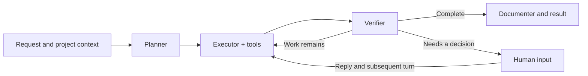
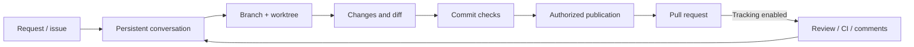
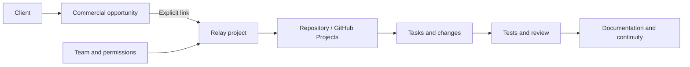
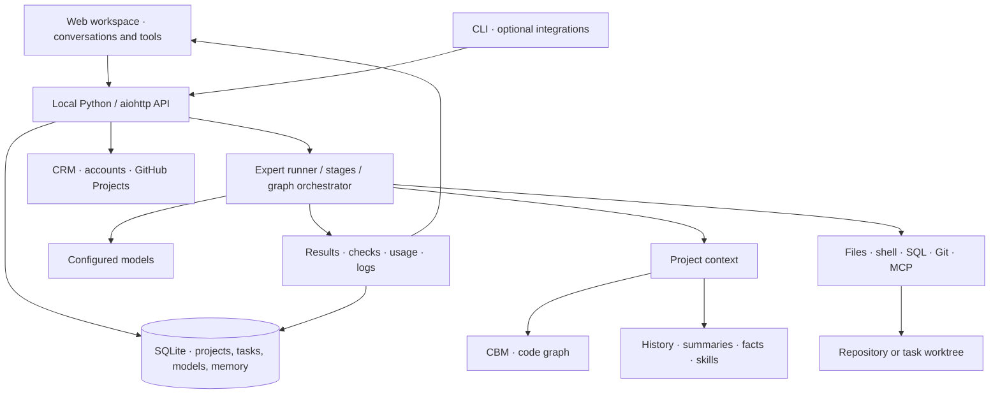

# FourBis Relay

[Español](README.md) · **English** · [Interactive demo](https://fourbis.github.io/4bis.relay-showcase/) · [Setup](docs/SETUP.md)

## Your team, repositories, and AI working on the same project

**From commercial follow-up to project execution, review, and documentation.**

FourBis Relay is a local workspace that brings together clients, projects, people, and AI agents. Register a repository, configure the models and tools allowed to work on it, assign the team, and keep tasks connected to your GitHub workflow.

Behind the chat are a model catalog, a searchable code index, project memory, staged execution, and a task graph that can split work while it runs. Around them are conversations, files, diffs, tests, personal accounts, boards, commercial context, and usage. You can see what the system is doing and continue from the work already completed.


*Relay interface with a fictional scenario. The graph shows dependencies and states; a completed run, a completed task, and a verified result are shown separately.*

The [public demo](https://fourbis.github.io/4bis.relay-showcase/) recreates part of the workflow in a browser: it does not call models or run tools. This repository also includes the server and workspace for local installation. Relay is experimental; the [validation evidence](docs/VALIDATION.md) describes what has been checked.

## Explore Relay

[Models](#models-configurable-for-each-part-of-the-work) · [Indexing and context](#a-repository-the-agent-can-explore-with-context) · [Execution and graphs](#from-a-request-to-a-graph-that-can-change-as-work-progresses) · [Workspace](#a-workspace-for-working-with-results) · [GitHub](#a-task-with-its-own-branch-diff-and-pull-request) · [Team and CRM](#from-client-to-team-and-repository) · [Tools](#tools-skills-and-integrations) · [Usage](#see-activity-and-understand-usage) · [Architecture](#how-the-pieces-connect) · [First project](#get-your-first-project-working)

| What you need | What Relay offers |
|---|---|
| Choose how to use AI | Model catalog; configuration by role, project, and message; declared vision, context windows, and rates. |
| Understand a repository | CBM indexing, symbols, callers/callees, snippets, search, and graph-derived diagrams. |
| Keep context | History, run notes, compaction, searchable summaries, and approved facts. |
| Execute substantial work | Planning, tools, verification, documentation, dependencies, parallel work, and bounded task subdivision. |
| Continue a task | Persistent conversation, its own branch and worktree, message queue, and pause/resume controls. |
| Review changes | Task diff, project checks, and commit-bound validation before publishing a PR. |
| Coordinate people | Roles, explicit project assignments, and personal GitHub and Google/Gmail accounts. |
| Keep commercial context | CRM read access, client/opportunity/project links, and access to related GitHub work. |
| Extend tools | Files, shell, SQL, Git, project skills, and configurable MCP servers. |
| Observe the system | Running executions, reports, metrics, tokens, cache, estimated costs, logs, and manually started night runs. |

The [capability map](docs/CAPABILITY_MAP.md) links these features to their implementation and documents their conditions and limits.

## Models configurable for each part of the work

Model selection is a configuration choice. In **Models**, you manage the catalog shown in selectors: the `provider:model` specification, display name, endpoint, credential or reference, enabled state, vision capability, context window, and input, output, and cache rates.

You can add an OpenAI-compatible endpoint from the catalog. The code also supports OpenAI, Anthropic, MiniMax, NVIDIA, and Ollama; each adapter requires its corresponding service, credentials, and dependencies. Verify compatibility against the endpoint you intend to use. **Test** makes a brief real request to the provider.

The base installation includes the SDK's OpenAI/MCP support. The native Anthropic adapter also requires its optional dependency, which is not included in that base installation.


*Fictional catalog rendered by the real module. Example values are not provider prices or measurements.*

### One model for each responsibility

| Role | Work it performs |
|---|---|
| **Planner** | Analyzes the request and proposes steps or a breakdown. |
| **Executor** | Uses project context and tools to do the work. |
| **Verifier** | Checks the result against the request and returns a verdict and observations. |
| **Documenter** | Prepares a final record of the work when the run allows it. |
| **Compactor** | Summarizes conversations to reduce context and support continuity. |

**Config** defines global values; project defaults can override them. In chat, you can choose the four execution roles for the next message. Leaving a selector blank keeps default resolution in effect: the UI lets you inspect which model is ultimately selected.

The graph planner also has a project setting, `graph_planner_model`, and a fallback model chain (`planner_fallback`). They are used to prepare the graph and propose subdivisions; this configuration is separate from the planner for a staged turn.


For example, you can reserve a more capable model for a difficult implementation and use another to plan or write its record. You can measure this choice with project metrics; separating roles does not by itself promise lower costs or better results.

Vision has three states: **supported**, **unsupported**, and **unmeasured**. Relay distinguishes an endpoint that has been checked from one without evidence yet. Context windows and rates are also configured values; they are not inferred from a model's name.

## A repository the agent can explore with context

Registering a project associates a local path, description, configuration, and tools. You can index it during setup, import it from an existing CBM index, or reindex it later. **Indexing** lets you browse folders, select repositories, start individual or bulk jobs, and inspect indexed files, nodes, relationships, and status.


*Illustrative index status. The screenshot uses fictional responses; a real index requires the CBM component to be configured.*

Relay combines several sources of knowledge:

| Source | What it contains | How it reaches the agent |
|---|---|---|
| **CBM code graph** | Repository structure extracted by the indexer, including symbols and relationships available for the language and indexer. | `cbm_query` queries the project for functions, classes, references, callers/callees, snippets, and architecture. |
| **Repository files** | Code, instructions, and documentation that the tools can read. | On-demand browsing, reading, and search, subject to size and result limits. |
| **History and run notes** | Conversation messages, tool activity, and the run record. | Reused when continuing that conversation. |
| **FTS5 summaries** | Summaries of compacted conversations. | A memory request searches project summaries and adds up to three to the context. |
| **Approved facts** | Knowledge distilled from conversations and reviewed by a person. | Included when the project enables `facts_always_on`; pending facts are not treated as approved. |
| **Skills** | Procedures and instructions available to the project. | The relevant catalog is exposed, and the agent can read a skill's full content. |
| **SQL and other tools** | Information retrieved from configured connections or services. | Queried when the task needs it; the whole database is not preloaded. |

### What happens when code changes

The watcher can request incremental reindexing after changes in enabled repositories included in the index. It groups events after a short quiet period and filters common build artifacts. You can also reindex manually or in bulk.

Watching depends on CBM and process configuration; the set of watched projects is captured when the watcher starts. Registering a new project does not mean it is already watched automatically. The [capability map](docs/CAPABILITY_MAP.md) explains this cycle and its limits.

### From the graph to an explanation that stays with the project

The CBM bridge also exposes change-impact queries, paths between symbols, and Cypher queries over the graph. You can investigate dependencies, call flows, and structural metrics without starting by reading every file. Availability depends on the index and the installed CBM version.

**Diagrams** can query architecture, classes, states, and sequences. Interpreted diagram generation uses the available graph data and a model; you can review the result and save it as Mermaid or SVG under `docs/diagrams/`.

For example, you can ask: “find who calls this service, explain the flow, and leave a sequence diagram in the documentation.” The agent combines specific queries with real files. CBM coverage, memory summaries, and document reading are distinct: Relay does not promise universal indexing or that the whole repository is sent to a model.

## From a request to a graph that can change as work progresses

Relay has two related workflows. A conversation can execute a request **in stages**; substantial work can be organized as a **task graph** with dependencies.



The plan guides the executor. The verifier can say the work is complete, more work remains, or a human decision is needed. The result retains information about stages and their errors. Stages are configurable, and some are skipped for trivial requests or interrupted runs.

Model review and repository tests provide different evidence. A favorable verdict does not replace a build or test, and a finished turn does not automatically mean the request was fulfilled.

### Dependencies, parallel work, and task subdivision

A graph retains tasks, criteria, and states. Ready nodes with no conflicts can progress in parallel; others wait for their dependencies. You can inspect each node and its result from chat.

When a task reports that its budget is exhausted with work remaining, autosplit can use partial progress to propose subtasks, save them, and update dependencies. The parent remains in the history. This lets the plan adapt to what the agent finds while working.

Subdivision has limits: in this public version, a parent is split once and its subtasks cannot be split again. If the system cannot continue, it shows the state for human attention. Request, tool, token, time, and continuation budgets still apply. See [long-running work](docs/LONG_RUNNING_WORK.md) for the specific contract.

**Example:** migrating an interface might begin as API, client, and tests. If the client turns out to be too broad, Relay can split it into structure, pages, and integration; tests then wait for the updated dependencies. The person can still see what is done, in progress, or needs attention.

## A workspace for working with results

The workspace lets you keep conversations, data, and tools visible at the same time. Each conversation has its own window and draft; you can move, resize, minimize, expand, and tile windows.


**Open in workspace** separates a response from its thread so you can consult it while continuing to work. From there, you can extract tables and SVG charts, filter rows, copy TSV, or return to the source conversation. These are existing results with provenance, not executable forms invented by the model.

- **Chat:** history, messages, attachments, tools used, plan, task, and access to the diff.
- **Multiple conversations:** independent windows, local names, and targeted message sending.
- **Files and diff:** inspect work associated with the project or task worktree.
- **Diagrams and tables:** keep results in view while you chat.
- **Keyboard:** `Ctrl+Shift+K` opens tools; `Ctrl+K` searches projects, chats, and conversations; `/open projects` opens that tool without calling the model.
- **Mobile:** one active window and a tray for switching tools.

The layout is saved in the browser; history is recovered from the server. Unsent drafts do not survive a page reload. Closing a window does not cancel the server task. Global search finds project and conversation records; searches inside code use repository tools.

More controls and behavior are described in the [workspace guide](docs/UI_WORKSPACE.md).

## A task with its own branch, diff, and pull request

A **Change with PR** conversation can keep its branch and worktree between messages. The request, code, verification, and PR share a task identity.



Before preparing work, Relay checks Git state and the `develop` base. Later messages reuse the task folder and enter its queue. The diff belongs to that workspace, which may differ from the checkout open in your editor.

**Pause**, **Cancel**, and **Continue** have different effects. Pause stops new continuations and publications; cancel requests that work be interrupted; continue reconciles state and allows work to resume. Files are preserved. An uncertain effect after an interruption needs review before it is retried.

Publishing requires the relevant permissions and checks tied to the commit being sent. A modified tree or different SHA makes previous evidence stale. The PR remains for review; merging and deployment are later decisions.

**Optional tracking** can collect comments, change requests, and CI failures, then correct and update the same PR. It starts disabled and uses iteration, time, and token limits. With no new activity, it does not start another model turn. Details about recovery, permissions, and limits are in [persistent tasks](docs/PERSISTENT_TASKS.md).

## From client to team and repository

Relay is designed to support the work a company needs to deliver. The **CRM** module reads a snapshot from the configured CRM and lets you associate clients and opportunities with projects. From there, you can reach the repository and its board, issues, and PRs.


*Actual panel with fictional company, contact, and opportunity data. CRM reading and links are simulated for this screenshot only.*



**Management** shows GitHub Projects boards, their associated work, and projects awaiting a link. The board view is read-only; move cards in GitHub. Commercial context can help prioritize a technical conversation without reconstructing which client or project it belongs to.

The current integration reads companies, opportunities, and contacts from the CRM and stores links locally. Turning an opportunity into a task remains an explicit decision. Client health is built from available tracking and work signals; it does not prove billing, acceptance, or satisfaction.

### Visible and enforced permissions


| Role | Scope |
|---|---|
| **Admin** | Manages team members, assigns projects, and controls PR publication and tracking. |
| **Subadmin** | Works on assigned projects, manages Dev members, and views commercial context and usage. |
| **Dev** | Can edit, build, and test assigned projects. |
| **Finance** | Views CRM, reports, and usage estimates with limited scope; cannot access code or chats. |

The backend enforces permissions. Project assignment, GitHub connection, and task mode are separate requirements. A task created in read-only mode keeps that mode until its user explicitly enables write access.

In **My Account**, each person connects their own GitHub and Google/Gmail accounts. Authenticated operations retain the actor; they do not silently substitute the administrator's account. Reading email is requested, and sending uses a draft that the person reviews and confirms.

See [Team Access](docs/TEAM_ACCESS.md) and [My Account](docs/USER_ACCOUNTS.md) to configure identity and understand each role's limits.

## Tools, skills, and integrations

The project defines which resources are available to the agent. These are specific surfaces of the system:

| Surface | What it enables | What you need |
|---|---|---|
| **Files and shell** | Browse, search, read, and modify files; run build and test commands. | Local repository, project tools, and task permissions. |
| **Git / GitHub** | Inspect repositories, issues, PRs, and boards; perform authorized operations. | Git, `gh` where applicable, and a personal account with repository access. |
| **SQL** | Query registered connections and results from technical work. | Connectivity, driver, and credentials; ad hoc connections are read-only by default. |
| **MCPs** | Catalog servers, transports, project scope, activation, and connection checks. | MCP server and configured permissions; registration alone does not prove it works. |
| **Skills** | Discover procedures, surface relevant instructions, and read their full content. | Repository skills or the configured global directory. |
| **Commands** | Register named actions with handlers, arguments, and execution records; dispatch them through the API or integrations. | Available handlers and permission to perform the operation. |
| **Voice** | Save audio, transcribe it, inspect transcripts, and process them with an expert. | Configured transcription endpoint, model, and credentials. |
| **Google/Gmail** | Personal connection, requested lookup, and a draft with send confirmation. | Installation's own OAuth setup and the person's consent. |
| **Google Calendar** | Read and create events through the calendar tools. | Process credentials and an explicitly enabled real mode (`GOOGLE_REAL`); separate from personal Gmail OAuth. |
| **Discord and VS Code** | Entry points, notifications, and continuity through companion integrations. | A configured bot/extension or external receiver; opening the UI does not activate them. |

Repository skills take precedence over global skills with the same name. The MCP catalog distinguishes persistent and on-demand tools, permissions, and projects. Installation, activation, and health checks are explicit steps; a tool's name is not evidence that it is connected.

The GitHub MCP onboarding flow prepares a clone, analysis, and command proposal before confirmation and handshake. Installing dependencies may require a manual step. The repository includes a Playwright wrapper for navigation, reading, and screenshots; it needs the browser and its configuration. Capabilities can be added per project without loading every tool into every conversation.

**Night Runs** explicitly starts a project-configured work run with a plan, sequential tasks, build/test checks, human intervention points, and a report. It can prepare a consolidated draft PR with accepted changes. It does not include an hourly automatic scheduler. **Zombies** lists old chats still recorded as running despite having no live process and allows you to clean them up explicitly. These operational controls are separate from PR tracking.

## See activity and understand usage


**Status** shows process and component health. **Running** lets you inspect executions. **Report** and **Metrics** bring together activity, states, tools used, and tokens; they can break usage down by project, model/provider, and role according to the available data. **Logs** help you follow a specific execution.

Input, output, and cache are distinguished to show where context is used. Costs are estimated from catalog rates and provider-reported usage; data may be missing, and estimates are not a bill. The screenshot uses fictional data.

Cache usage is shown when reported for the main execution; planning, verification, and documentation rows do not currently record that breakdown.

OpenTelemetry instrumentation is optional. The exported content depends on its configuration; you do not need to enable it to use the workspace.

## How the pieces connect



The Python server serves the API and interface. SQLite stores durable configuration and state; conversation files, attachments, and worktrees live on disk. The frontend uses native JavaScript modules and compiled CSS. For each project, the runner composes context, models, and tools.

Relay runs as a single process. A worktree separates a task's files; it shares the machine's operating system, processes, and resources. See [ARCHITECTURE.md](docs/ARCHITECTURE.md) and [SECURITY.md](SECURITY.md) for architecture and limits.

## Get your first project working

### 1. Start the local workspace

Basic requirements: **Windows, PowerShell, and Python 3.11 or later**. Code tasks also need Git and the toolchain for your repository. CBM, providers, CRM, OAuth, and MCP are configured according to the capabilities you intend to use.

From the repository root:

```powershell
python -m venv .\mcp-server\.venv
& ".\mcp-server\.venv\Scripts\Activate.ps1"
python -m pip install -e .\mcp-server
.\mcp-server\start.ps1
```

In another terminal:

```powershell
Invoke-RestMethod http://127.0.0.1:8413/health
Start-Process http://127.0.0.1:8413/admin/
```

`start.ps1` prepares the process, sets port 8413, and does not automatically load `.env`. The server can start without a model provider; to run an expert, configure one. See [SETUP.md](docs/SETUP.md) for details and variables.

### 2. Define the project and its context

1. In **Models**, register and enable the endpoint you will use. Check its response if you want to run the real test.
2. In **Config**, review the executor and the models for the other stages.
3. In **Projects**, register a local repository and enable the appropriate tools.
4. If you will use the code graph, configure CBM and run indexing. Check its status in **Indexing**.
5. Review the project's instructions, skills, and build/test commands.

**Where to configure CBM:** the external component is named `codebase-memory-mcp`. Relay looks for its executable in `PATH` and, on Windows, at `%LOCALAPPDATA%\Programs\codebase-memory-mcp\codebase-memory-mcp.exe`. Installing the Relay Python package does not install that binary. Set the repository parent folder in **Config → Paths → Repository root**. The default cache lives at `~/.4bis/cbm-cache`.

**How to check it:** **Status → cbm binary** indicates whether the executable was found. **Projects → New project → Index in cbm now** requests an index job. For existing repositories, use **Indexing → Browse → Index selected**, or choose the project and **Reindex**. Inspect the job result: detecting the binary and completing an index are separate checks.

**Where to adjust each project:** open **Edit project → Project flags → Model per stage**. Tool groups and the **MCPs** catalog configure available capabilities. Flag selectors and checkboxes save changes immediately; the chat model selector applies only to the next message.

### 3. Start with a question, then create a task

A first read-only request:

> Explain how a request enters this application. Find its entry points and dependencies, cite the files, and identify anything you cannot verify.

Then, for a focused change:

> Add pagination to the product list. Keep the current filters, check the behavior with the project's tests, and document the parameters.

Choose the appropriate mode when creating the conversation. For **Change with PR**, prepare GitHub access, permissions, the `develop` base, and verification commands. While work is underway, inspect the graph, results, and diff. Publish only after you have reviewed the change and authorized that action.

### 4. Add the team and commercial context

Assign projects in **Team**, connect accounts in **My Account**, and link boards and commercial records where relevant. Add these integrations as your process needs them.

## Why Relay exists and how it evolves

Relay grew out of FourBis's everyday work: keeping context across repositories, delegating execution, following client projects, and preserving evidence of what was delivered. It has evolved alongside model capabilities and the needs of the company and its team.

Its pieces are connected around the project. The catalog lets you change models; stages distribute responsibilities; indexing and memory provide context; tasks retain changes; accounts and permissions identify who can act; GitHub remains the place for review.

That idea guides its evolution: **bring a repository and a team together with AI inside a company's real workflow, from commercial follow-up through execution and documentation**. Each integration has its own requirements and should be checked where it will be used.

## Documentation and evidence

| To learn more | Document |
|---|---|
| Find where each capability is implemented | [Capability map](docs/CAPABILITY_MAP.md) |
| Install and configure | [Setup](docs/SETUP.md), [HTTP API](docs/API.md) |
| Use windows, chats, results, and keyboard controls | [Workspace](docs/UI_WORKSPACE.md), [Admin UI](docs/ADMIN_UI.md) |
| Understand continuity, publication, and subdivision | [Persistent tasks](docs/PERSISTENT_TASKS.md), [Long-running work](docs/LONG_RUNNING_WORK.md) |
| Manage people and connections | [Team access](docs/TEAM_ACCESS.md), [Personal accounts](docs/USER_ACCOUNTS.md) |
| Understand implementation and limits | [Architecture](docs/ARCHITECTURE.md), [Security](SECURITY.md) |
| Review tests and screenshot provenance | [Validation](docs/VALIDATION.md), [Reproducible visual tour](docs/qa/readme-tour.md) |

Screenshots use fictional identities and projects. New configuration and indexing screenshots render the real modules with controlled responses; they demonstrate presentation, not provider calls or actual indexing. The static demo recreates interactions and does not connect to an installation.

The documented installation targets Windows. Validation with simulated providers does not establish deployment, multi-user isolation, or external service availability. You can review the code, reproduce checks, and evaluate integrations in your own environment.

## Contribute and share

If you try a workflow, an [issue](https://github.com/FourBis/4bis.relay-showcase/issues) with the request, expected result, observed result, and version helps improve Relay. See [CONTRIBUTING.md](CONTRIBUTING.md) for changes.

FourBis · Jeremías Badilla. Code under the [MIT License](LICENSE); see [third-party notices](THIRD_PARTY_NOTICES.md).
