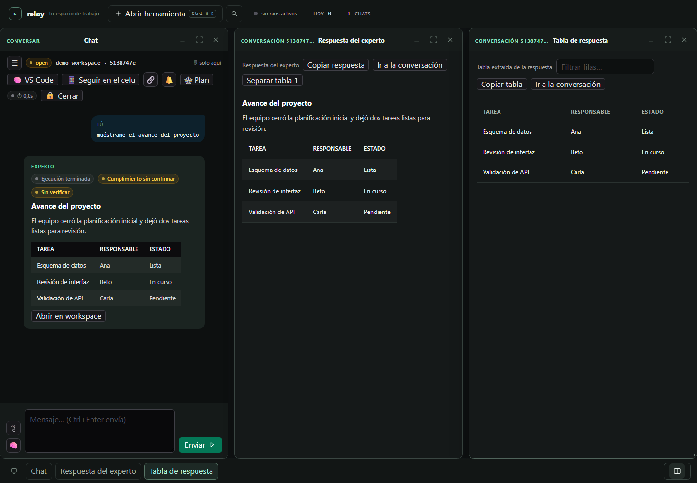

# FourBis Relay

FourBis Relay es un workspace local para trabajar con IA conversacional sobre varios repositorios. Coordina conversaciones, herramientas y expertos configurables desde una interfaz web, manteniendo el contexto de cada proyecto en la máquina del usuario.

Es un proyecto de portafolio de FourBis y Jeremías Badilla, distribuido bajo la licencia MIT. El código propio está cubierto por [LICENSE](LICENSE); las dependencias de terceros conservan sus propias licencias y avisos.

## Capacidades

- Conversaciones persistentes por proyecto, con historial, compactación y memoria buscable.
- Ejecución de expertos por etapas: planificación, ejecución, verificación y documentación.
- Herramientas nativas para archivos, shell y consultas SQL, con límites configurables.
- Integración opcional con servidores MCP para browser, GitHub y otras capacidades.
- Workspace web con ventanas de chat, tablas, estado de ejecución, proyectos, modelos, logs y configuración.
- API HTTP para integrar una CLI, un bot u otras interfaces.
- Persistencia local en SQLite y archivos de estado; el arranque crea el esquema cuando es necesario.

Las capacidades visuales del workspace están descritas en [docs/UI_WORKSPACE.md](docs/UI_WORKSPACE.md).



Datos de ejemplo renderizados en un workspace local.

## Inicio rápido en Windows

Requisitos: Python 3.11 o posterior y PowerShell. La portabilidad a otros sistemas no está validada.

```powershell
cd C:\ruta\al\repositorio\mcp-server
python -m venv .venv
& ".\.venv\Scripts\Activate.ps1"
python -m pip install --upgrade pip
pip install -e .
.\start.ps1
```

En otra terminal, comprueba que el proceso responde:

```powershell
Invoke-RestMethod http://127.0.0.1:8413/health
Start-Process http://127.0.0.1:8413/admin/
```

`start.ps1` prepara `PYTHONPATH=src`, `MCP_PORT=8413`, `BOT_NOTIFY_URL`, `GOOGLE_REAL=0` y un `STATE_DIR` local antes de ejecutar el servidor. No lee automáticamente un archivo `.env`. La configuración operativa y las credenciales de modelos se administran en el catálogo **Modelos** de la Admin UI. Sin un proveedor configurado, el relay puede arrancar, pero una ejecución de experto no podrá completarse.

## Documentación

- [Setup completo](docs/SETUP.md)
- [API HTTP](docs/API.md)
- [Admin UI](docs/ADMIN_UI.md)
- [Workspace](docs/UI_WORKSPACE.md)
- [Arquitectura](docs/ARCHITECTURE.md)
- [Contribuir](CONTRIBUTING.md)

## Estado del proyecto

El repositorio es experimental y su instalación validada es Windows. La validación concreta se documenta en [docs/VALIDATION.md](docs/VALIDATION.md); este README no declara una suite completa en verde ni un despliegue de producción.

## Atribución

FourBis · Jeremías Badilla

## Licencia

MIT. Consulta [LICENSE](LICENSE) para el texto completo. Las licencias de terceros se documentan por separado cuando corresponde.
