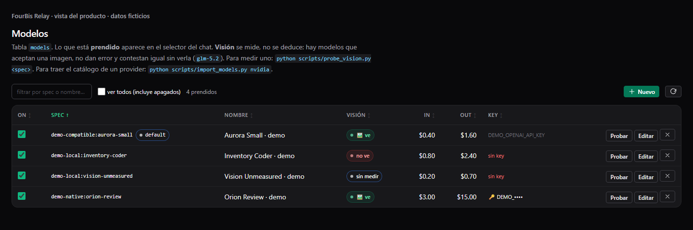
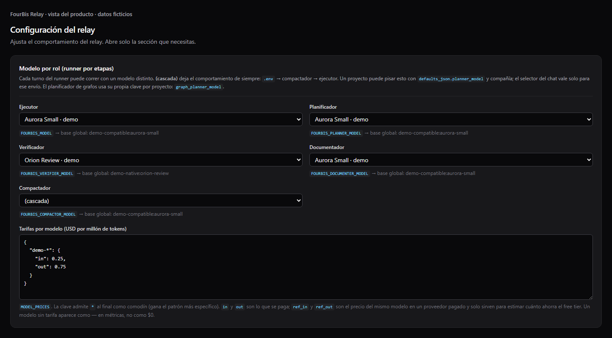
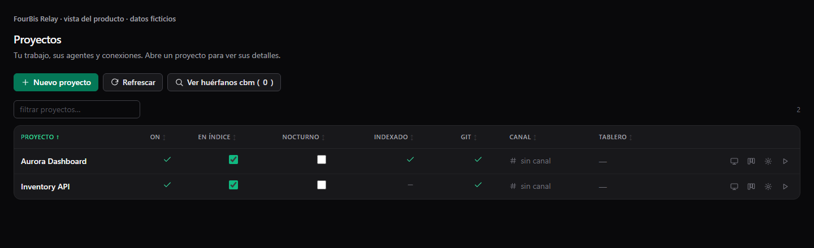
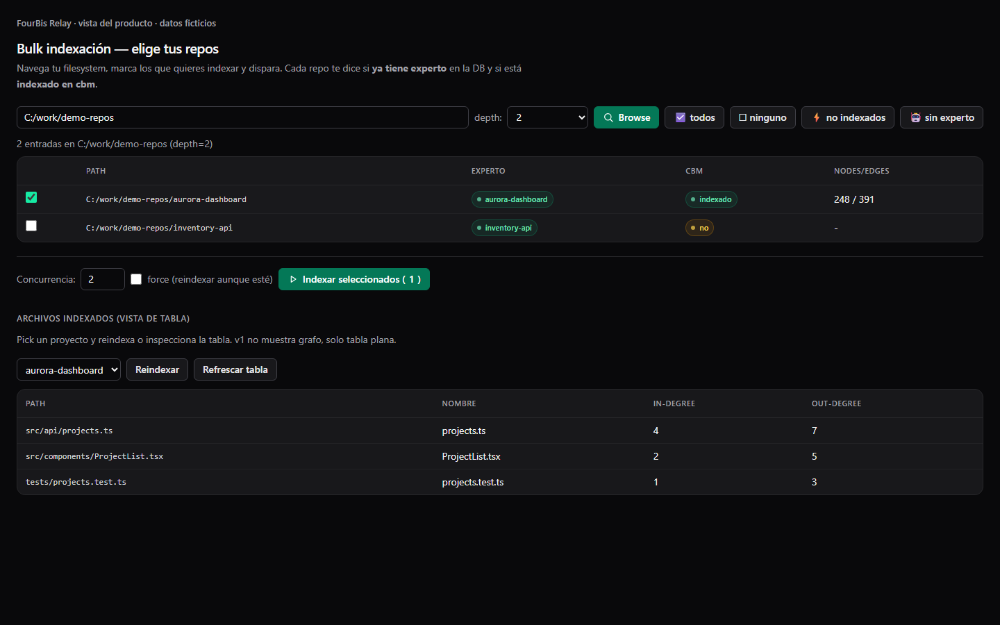
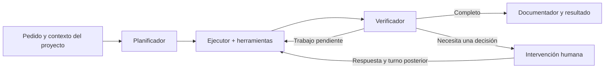
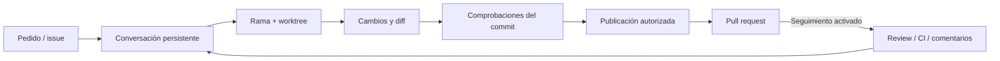
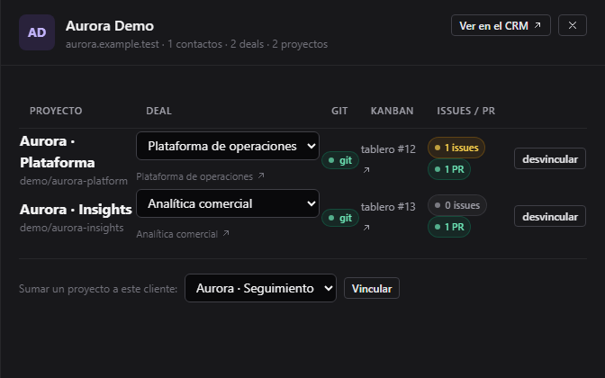
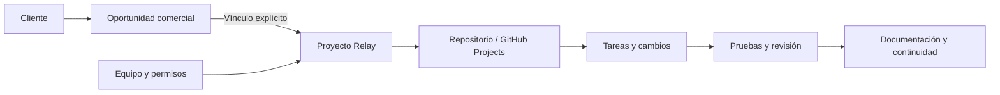
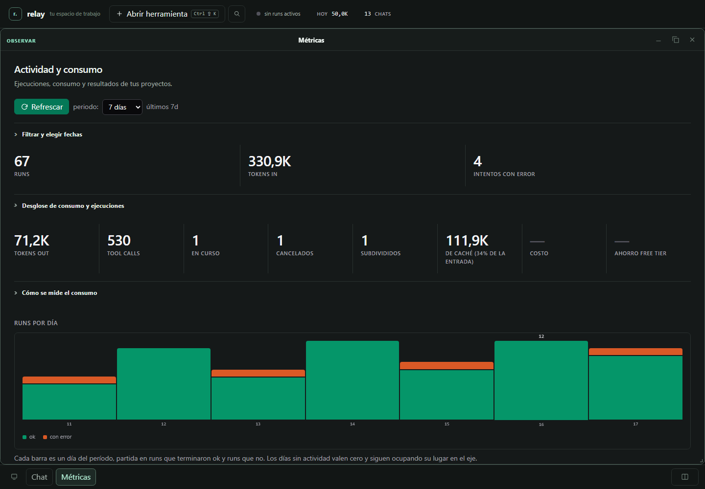
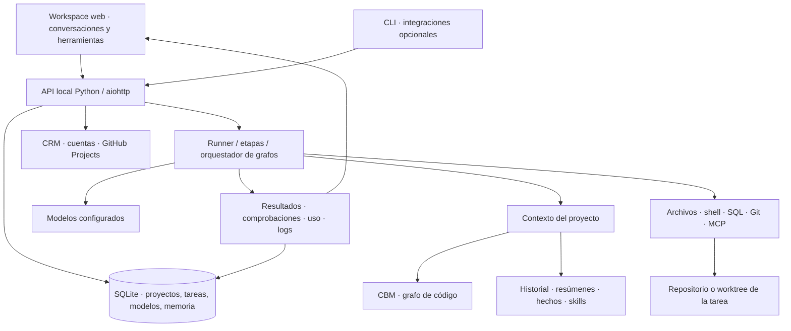

# FourBis Relay

**Español** · [English](README.en.md) · [Demo interactiva](https://fourbis.github.io/4bis.relay-showcase/) · [Instalación](docs/SETUP.md)

## Tu equipo, tus repositorios y la IA trabajando sobre el mismo proyecto

**Del seguimiento comercial a la ejecución, revisión y documentación del proyecto.**

FourBis Relay es un espacio de trabajo local que reúne clientes, proyectos, personas y agentes de IA. Registras un repositorio, configuras los modelos y herramientas que pueden trabajar en él, asignas el equipo y mantienes las tareas conectadas con tu proceso de GitHub.

Detrás del chat hay un catálogo de modelos, un índice de código consultable, memoria del proyecto, ejecución por etapas y un grafo de tareas que puede subdividir trabajo durante la ejecución. Alrededor están las conversaciones, archivos, diffs, pruebas, cuentas personales, tableros, contexto comercial y consumo. Puedes ver qué está haciendo el sistema y continuar trabajando sobre lo que ya avanzó.


*Interfaz de Relay con un escenario ficticio. El grafo muestra dependencias y estados; una ejecución terminada, una tarea cumplida y un resultado verificado se presentan por separado.*

La [demo pública](https://fourbis.github.io/4bis.relay-showcase/) recrea parte del recorrido en el navegador: no llama a modelos ni ejecuta herramientas. Este repositorio incluye también el servidor y el workspace para instalación local. Relay es experimental; la [evidencia de validación](docs/VALIDATION.md) describe qué se ha comprobado.

## Explora Relay

[Modelos](#modelos-configurables-para-cada-parte-del-trabajo) · [Indexación y contexto](#un-repositorio-que-el-agente-puede-explorar-con-contexto) · [Ejecución y grafos](#del-pedido-a-un-grafo-que-puede-cambiar-mientras-trabaja) · [Workspace](#un-workspace-para-trabajar-con-los-resultados) · [GitHub](#una-tarea-con-su-propia-rama-diff-y-pull-request) · [Equipo y CRM](#del-cliente-al-equipo-y-al-repositorio) · [Herramientas](#herramientas-skills-e-integraciones) · [Consumo](#ver-la-actividad-y-entender-el-consumo) · [Arquitectura](#cómo-se-conectan-las-piezas) · [Primer proyecto](#poner-tu-primer-proyecto-a-trabajar)

| Lo que necesitas | Lo que ofrece Relay |
|---|---|
| Elegir cómo usar la IA | Catálogo de modelos; configuración por rol, proyecto y mensaje; visión, contexto y tarifas declaradas. |
| Entender un repositorio | Indexación CBM, símbolos, callers/callees, snippets, búsqueda y diagramas derivados del grafo. |
| Mantener contexto | Historial, bitácora, compactación, resúmenes buscables y hechos aprobados. |
| Ejecutar trabajo amplio | Planificación, herramientas, verificación, documentación, dependencias, paralelismo y subdivisión acotada. |
| Continuar una tarea | Conversación persistente, rama y worktree propios, cola de mensajes y controles de pausa y continuación. |
| Revisar lo que cambió | Diff de la tarea, comprobaciones del proyecto y validación ligada al commit antes de publicar una PR. |
| Coordinar personas | Roles, asignaciones explícitas por proyecto y cuentas personales de GitHub y Google/Gmail. |
| Mantener el contexto comercial | Lectura del CRM, vínculos cliente/oportunidad/proyecto y acceso al trabajo asociado en GitHub. |
| Ampliar herramientas | Archivos, shell, SQL, Git, skills del proyecto y servidores MCP configurables. |
| Observar el sistema | Ejecuciones en curso, informes, métricas, tokens, caché, costos estimados, logs y trabajos nocturnos. |

El [mapa de capacidades](docs/CAPABILITY_MAP.md) enlaza estas funciones con su implementación y detalla condiciones y límites.

## Modelos configurables para cada parte del trabajo

El modelo es una decisión de configuración. En **Modelos** administras el catálogo que aparece en los selectores: especificación `proveedor:modelo`, nombre visible, endpoint, credencial o referencia, habilitación, capacidad de visión, ventana de contexto y tarifas de entrada, salida y caché.

Puedes agregar un endpoint compatible con OpenAI desde el catálogo. El código también contempla OpenAI, Anthropic, MiniMax, NVIDIA y Ollama; cada adaptador necesita su servicio, credenciales y dependencias correspondientes. La compatibilidad efectiva se comprueba con el endpoint que vas a usar. **Probar** realiza una petición real y breve al proveedor.

La instalación base incluye el soporte OpenAI/MCP del SDK. El adaptador nativo de Anthropic requiere además su dependencia opcional, que no está incluida en esa instalación base.



*Catálogo ficticio renderizado por el módulo real. Los valores del ejemplo no son precios ni mediciones de proveedores.*

### Un modelo por responsabilidad

| Rol | Trabajo que realiza |
|---|---|
| **Planificador** | Analiza el pedido y propone pasos o una descomposición. |
| **Ejecutor** | Consulta el contexto y utiliza las herramientas del proyecto para hacer el trabajo. |
| **Verificador** | Contrasta el resultado con el pedido y devuelve un veredicto y observaciones. |
| **Documentador** | Prepara el registro final del trabajo realizado cuando la ejecución lo permite. |
| **Compactador** | Resume conversaciones para reducir contexto y facilitar continuidad. |

En **Config** se definen los valores globales; los defaults del proyecto pueden sobrescribirlos. En el chat puedes elegir los cuatro roles de ejecución para el siguiente mensaje. Dejar un selector vacío conserva la resolución de defaults: la UI permite consultar qué modelo termina siendo efectivo.

El planificador de grafos tiene además su propia opción por proyecto, `graph_planner_model`, y una cascada de modelos alternativos (`planner_fallback`). Se utiliza al preparar el grafo y al proponer subdivisiones; es una configuración distinta del planificador de un turno por etapas.



Esto permite, por ejemplo, reservar un modelo más capaz para una implementación difícil y usar otro para planificar o redactar su registro. Es una elección que puedes medir con las métricas del proyecto; la separación por roles no promete por sí sola menor costo o mejor resultado.

La visión tiene tres estados: **ve**, **no ve** y **sin medir**. Relay distingue un endpoint comprobado de uno del que todavía no hay evidencia. El contexto y las tarifas también son datos configurados; no se deducen automáticamente del nombre del modelo.

## Un repositorio que el agente puede explorar con contexto

Registrar un proyecto asocia una ruta local, descripción, configuración y herramientas. Puedes indexarlo al darlo de alta, importarlo desde un índice CBM existente o reindexarlo después. **Indexación** permite explorar carpetas, seleccionar repositorios, lanzar trabajos individuales o por lote y consultar archivos, nodos, relaciones y estados.





*Estado de indexación ilustrativo. La captura usa respuestas ficticias; el índice real requiere el componente CBM configurado.*

Relay combina varias fuentes de conocimiento:

| Fuente | Qué contiene | Cómo llega al agente |
|---|---|---|
| **Grafo de código CBM** | Estructura extraída del repositorio: símbolos y relaciones disponibles según el lenguaje y el indexador. | `cbm_query` consulta el proyecto: funciones, clases, referencias, callers/callees, snippets y arquitectura. |
| **Archivos del repositorio** | Código, instrucciones y documentación que las herramientas puedan leer. | Navegación, lectura y búsqueda bajo demanda, con límites de tamaño y resultados. |
| **Historial y bitácora** | Mensajes, herramientas y registro de trabajo de la conversación. | Se reutilizan al continuar esa conversación. |
| **Resúmenes FTS5** | Resúmenes de conversaciones compactadas. | Una solicitud de memoria busca resúmenes del proyecto y aporta hasta tres al contexto. |
| **Hechos aprobados** | Conocimiento destilado y revisado por una persona. | Se incorpora si el proyecto activa `facts_always_on`; los hechos pendientes no se tratan como aprobados. |
| **Skills** | Procedimientos e instrucciones disponibles para el proyecto. | Se anuncia el catálogo pertinente y el agente puede leer una skill completa. |
| **SQL y otras herramientas** | Información obtenida de conexiones o servicios configurados. | Se consulta cuando la tarea lo requiere; no se precarga toda la base. |

### Qué ocurre cuando cambia el código

El watcher puede pedir reindexación incremental tras cambios en repositorios habilitados e incluidos en el índice. Agrupa eventos después de un breve período sin cambios y filtra artefactos habituales. También puedes reindexar manualmente o por lote.

La vigilancia depende de CBM y de la configuración del proceso; la lista de proyectos vigilados se toma al iniciar el watcher. Registrar un proyecto nuevo no implica que ya esté bajo vigilancia automática. El [mapa de capacidades](docs/CAPABILITY_MAP.md) explica este ciclo y sus límites.

### Del grafo a una explicación que queda en el proyecto

El puente con CBM también expone consultas de impacto de cambios, recorridos entre símbolos y consultas Cypher sobre el grafo. Puedes investigar dependencias, flujos de llamadas y métricas de estructura sin empezar por leer cada archivo. La disponibilidad de esos datos depende del índice y de la versión de CBM instalada.

**Diagramas** puede consultar arquitectura, clases, estados y secuencias. La generación interpretada usa los datos disponibles del grafo y un modelo; el resultado se puede revisar y guardar como Mermaid o SVG bajo `docs/diagrams/`.

Así puedes pedir: «encuentra quién llama a este servicio, explica el flujo y deja un diagrama de secuencia en la documentación». El agente combina consultas concretas y archivos reales. El alcance de CBM, los resúmenes de memoria y la lectura de documentos son distintos: no hay una promesa de indexación universal ni de enviar todo el repositorio al modelo.

## Del pedido a un grafo que puede cambiar mientras trabaja

Relay tiene dos recorridos relacionados. Una conversación puede ejecutar un pedido **por etapas**; un trabajo amplio puede organizarse como un **grafo de tareas** con dependencias.



El plan guía al ejecutor. El verificador puede indicar que está completo, que falta trabajo o que necesita una decisión humana. El resultado conserva información de las etapas y sus errores. Las etapas son configurables y algunas se omiten en pedidos triviales o ejecuciones interrumpidas.

La revisión del modelo y las pruebas del repositorio aportan evidencias distintas. Un veredicto favorable no sustituye una compilación o un test, y un turno terminado no significa automáticamente que se cumplió el pedido.

### Dependencias, paralelismo y subdivisión

Un grafo conserva tareas, criterios y estados. Los nodos que están listos y no tienen conflictos pueden avanzar en paralelo; los demás esperan sus dependencias. Desde el chat puedes inspeccionar cada nodo y su resultado.

Cuando una tarea devuelve una señal de presupuesto agotado con trabajo pendiente, el autosplit puede usar su avance parcial para proponer subtareas, guardarlas y actualizar las dependencias. El padre permanece en el historial. Esto permite que el plan se adapte a lo que el agente encuentra al trabajar.

La subdivisión tiene límites: en esta versión pública un padre se divide una vez y sus subtareas no se vuelven a subdividir. Si el sistema no puede continuar, muestra el estado para intervención. Los presupuestos de solicitudes, herramientas, tokens, tiempo y continuaciones siguen aplicándose. Consulta [trabajo largo](docs/LONG_RUNNING_WORK.md) para el contrato concreto.

**Ejemplo de uso:** migrar una interfaz puede empezar como API, cliente y pruebas. Si el cliente resulta demasiado amplio, Relay puede separarlo en estructura, páginas e integración; las pruebas quedan esperando las dependencias actualizadas. La persona sigue viendo qué terminó, qué está en curso y qué necesita atención.

## Un workspace para trabajar con los resultados

El workspace permite mantener conversaciones, datos y herramientas visibles al mismo tiempo. Cada conversación tiene su propia ventana y borrador; puedes mover, redimensionar, minimizar, expandir y ordenar ventanas en mosaico.


**Abrir en workspace** separa una respuesta del hilo para consultarla mientras continúas trabajando. Desde ella puedes extraer tablas y gráficos SVG, filtrar filas, copiar TSV o volver a la conversación de origen. Son resultados existentes con procedencia; no formularios ejecutables inventados por el modelo.

- **Chat:** historial, mensajes, adjuntos, herramientas utilizadas, plan, tarea y acceso al diff.
- **Varias conversaciones:** ventanas independientes, nombres locales y envío dirigido a cada conversación.
- **Archivos y diff:** inspección del trabajo asociado al proyecto o al worktree de la tarea.
- **Diagramas y tablas:** resultados que permanecen a la vista mientras conversas.
- **Teclado:** `Ctrl+Mayús+K` abre herramientas; `Ctrl+K` busca proyectos, chats y conversaciones; `/abrir proyectos` abre esa herramienta sin llamar al modelo.
- **Móvil:** una ventana activa y una bandeja para cambiar de herramienta.

La disposición se guarda en el navegador; el historial se recupera del servidor. Los borradores sin enviar no sobreviven a recargar la página. Cerrar una ventana no cancela la tarea del servidor. La búsqueda global encuentra registros de proyectos y conversaciones; las búsquedas dentro del código usan las herramientas de repositorio.

Más controles y comportamiento en la [guía del workspace](docs/UI_WORKSPACE.md).

## Una tarea con su propia rama, diff y pull request

Una conversación de **Cambio con PR** puede mantener su rama y worktree entre mensajes. El pedido, el código, la verificación y la PR comparten una identidad de tarea.



Antes de preparar el trabajo, Relay comprueba el estado Git y la base `develop`. Los mensajes siguientes reutilizan la carpeta de la tarea y entran en su cola. El diff corresponde a ese workspace, que puede ser distinto del checkout que tienes abierto en tu editor.

**Pausar**, **Cancelar** y **Continuar** tienen efectos diferentes. Pausar frena nuevas continuaciones y publicaciones; cancelar solicita interrumpir el trabajo; continuar reconcilia el estado y permite retomarlo. Los archivos se conservan. Un efecto incierto tras una interrupción requiere revisión antes de repetirse.

Publicar exige los permisos correspondientes y comprobaciones asociadas al commit que se va a enviar. Un árbol modificado o un SHA diferente vuelve obsoleta la evidencia anterior. La PR queda para revisión; merge y despliegue son decisiones posteriores.

El **seguimiento opcional** puede recoger comentarios, solicitudes de cambios y fallos de CI, corregir y actualizar la misma PR. Empieza apagado y usa topes de iteraciones, tiempo y tokens. Sin novedades no genera otro turno del modelo. Los detalles de recuperación, permisos y límites están en [tareas persistentes](docs/PERSISTENT_TASKS.md).

## Del cliente al equipo y al repositorio

El objetivo de Relay es acompañar el trabajo que una empresa tiene que entregar. El módulo **CRM** lee una instantánea del CRM configurado y permite asociar clientes y oportunidades con proyectos. Desde ese contexto puedes llegar al repositorio y su tablero, issues y PRs.



*Panel real con una empresa, contactos y oportunidades ficticias. La lectura del CRM y sus vínculos se simulan únicamente para esta captura.*



**Gestión** muestra tableros de GitHub Projects, su trabajo asociado y proyectos pendientes de vincular. La vista del tablero es de consulta; mover tarjetas se hace en GitHub. El contexto comercial puede ayudar a priorizar una conversación técnica sin volver a reconstruir a qué cliente o proyecto pertenece.

La integración actual lee empresas, oportunidades y contactos del CRM y conserva vínculos locales. Convertir una oportunidad en una tarea sigue siendo una decisión explícita. La salud de clientes se construye con señales disponibles de seguimiento y trabajo; no demuestra facturación, aceptación ni satisfacción.

### Permisos que se ven y se aplican


| Rol | Alcance |
|---|---|
| **Admin** | Administra integrantes, asigna proyectos y controla publicación y seguimiento de PR. |
| **Subadmin** | Trabaja en proyectos asignados, gestiona integrantes Dev y consulta contexto comercial y consumo. |
| **Dev** | Puede editar, compilar y probar los proyectos que le han asignado. |
| **Finanzas** | Consulta CRM, informes y estimaciones de consumo con un alcance limitado; no accede a código ni chats. |

El backend comprueba los permisos. Asignación de proyecto, conexión de GitHub y modo de la tarea son requisitos separados. Una tarea creada en lectura conserva ese modo hasta que su usuario habilita escritura explícitamente.

En **Mi cuenta**, cada persona conecta su propio GitHub y Google/Gmail. Las operaciones autenticadas conservan el actor; no se sustituye silenciosamente su cuenta por la del administrador. La lectura de correo es solicitada y el envío usa un borrador que la persona revisa y confirma.

Consulta [Equipo](docs/TEAM_ACCESS.md) y [Mi cuenta](docs/USER_ACCOUNTS.md) para configurar la identidad y entender los límites de cada rol.

## Herramientas, skills e integraciones

El proyecto define qué recursos están disponibles para el agente. Estas son superficies concretas del sistema:

| Superficie | Qué permite | Qué necesitas |
|---|---|---|
| **Archivos y shell** | Explorar, buscar, leer y modificar archivos; ejecutar comandos de compilación y pruebas. | Repositorio local, herramientas del proyecto y permisos de la tarea. |
| **Git / GitHub** | Consultar repositorios, issues, PR y tableros; realizar operaciones autorizadas. | Git, `gh` cuando corresponda y conexión personal con acceso al repo. |
| **SQL** | Consultar conexiones registradas y resultados desde el trabajo técnico. | Conectividad, driver y credenciales; lectura por defecto en conexiones ad hoc. |
| **MCPs** | Catálogo de servidores, transportes, alcance por proyecto, activación y comprobación de conexión. | Servidor MCP y permisos configurados; un registro no acredita que funcione. |
| **Skills** | Descubrir procedimientos, presentar instrucciones relevantes y leer su contenido completo. | Skills del repositorio o directorio global configurado. |
| **Comandos** | Registrar acciones por nombre, con handler, argumentos y registro de ejecución; despacharlas desde API o integraciones. | Handlers disponibles y permisos para la operación. |
| **Voz** | Guardar audio, transcribirlo, consultar transcripts y procesarlos con un experto. | Endpoint de transcripción, modelo y credenciales configurados. |
| **Google/Gmail** | Conexión personal, consulta solicitada y borrador con confirmación de envío. | OAuth propio de la instalación y consentimiento de la persona. |
| **Google Calendar** | Consultar y crear eventos mediante las herramientas de calendario. | Configuración de proceso y modo real explícito; es un mecanismo separado del OAuth personal de Gmail. |
| **Discord y VS Code** | Puntos de entrada, notificaciones y continuidad con integraciones complementarias. | Bot/extensión o receptor externo configurado; no vienen activos por abrir la UI. |

Las skills del repositorio tienen prioridad sobre las globales del mismo nombre. El catálogo MCP distingue herramientas permanentes y bajo demanda, permisos y proyectos. Su instalación, activación y salud son pasos explícitos; el nombre de una herramienta no es evidencia de que esté conectada.

El recorrido para incorporar un MCP desde GitHub prepara un clon, un análisis y una propuesta de comando antes de la confirmación y el handshake. La instalación de dependencias puede requerir un paso manual. El repositorio incluye un wrapper Playwright para navegación, lectura y capturas; necesita el navegador y su configuración. Puedes incorporar capacidades por proyecto sin cargar todas las herramientas en cada conversación.

**Night Runs** inicia explícitamente una corrida de trabajo configurada por proyecto: plan, tareas secuenciales, comprobaciones de build/test, puntos de intervención humana e informe. Puede preparar una PR draft consolidada con los cambios aceptados. No incluye un scheduler horario automático. **Zombies** lista chats antiguos que siguen registrados como en ejecución sin proceso vivo y permite su limpieza explícita. Son controles operativos distintos del seguimiento de una PR.

## Ver la actividad y entender el consumo



**Estado** muestra la salud del proceso y sus componentes. **En curso** permite inspeccionar ejecuciones. **Informe** y **Métricas** reúnen actividad, estados, herramientas utilizadas y tokens; permiten desglosar el uso por proyecto, modelo/proveedor y rol según los datos disponibles. **Logs** ayuda a seguir una ejecución concreta.

La entrada, salida y caché se distinguen para entender dónde se consume contexto. Los costos se estiman con las tarifas del catálogo y lo que reporte el proveedor; pueden faltar datos y no equivalen a una factura. La captura muestra datos ficticios.

La caché se muestra cuando hay datos de la ejecución principal; las filas de planificación, verificación y documentación no registran ese desglose actualmente.

La instrumentación OpenTelemetry es opcional. El contenido exportado depende de su configuración; no hace falta activarla para usar el workspace.

## Cómo se conectan las piezas



El servidor Python sirve la API y la interfaz. SQLite conserva configuración y estado durable; archivos de conversación, adjuntos y worktrees viven en disco. El frontend usa módulos JavaScript nativos y CSS compilado. El runner compone contexto, modelos y herramientas para cada proyecto.

El modo operativo es un proceso Relay. Un worktree separa archivos de una tarea; comparte el sistema operativo, procesos y recursos de la máquina. Para la arquitectura y sus límites consulta [ARCHITECTURE.md](docs/ARCHITECTURE.md) y [SECURITY.md](SECURITY.md).

## Poner tu primer proyecto a trabajar

### 1. Arranca el workspace local

Requisitos básicos: **Windows, PowerShell y Python 3.11 o posterior**. Para tareas de código necesitas también Git y el toolchain de tu repositorio. CBM, proveedores, CRM, OAuth y MCP se configuran según las capacidades que vayas a utilizar.

Desde la raíz del repositorio:

```powershell
python -m venv .\mcp-server\.venv
& ".\mcp-server\.venv\Scripts\Activate.ps1"
python -m pip install -e .\mcp-server
.\mcp-server\start.ps1
```

En otra terminal:

```powershell
Invoke-RestMethod http://127.0.0.1:8413/health
Start-Process http://127.0.0.1:8413/admin/
```

`start.ps1` prepara el proceso, fija el puerto 8413 y no carga automáticamente `.env`. El servidor puede arrancar sin un proveedor de modelos; para ejecutar un experto debes configurar uno. Detalles y variables en [SETUP.md](docs/SETUP.md).

### 2. Define el proyecto y el contexto

1. En **Modelos**, registra y habilita el endpoint que vas a usar. Comprueba su respuesta si deseas ejecutar la prueba real.
2. En **Config**, revisa el ejecutor y los modelos de las demás etapas.
3. En **Proyectos**, registra un repositorio local y habilita las herramientas apropiadas.
4. Si usarás el grafo de código, configura CBM y ejecuta la indexación. Consulta su estado en **Indexación**.
5. Revisa instrucciones, skills y comandos de build/test del proyecto.

**Dónde configurar CBM:** el componente externo se llama `codebase-memory-mcp`. Relay busca su ejecutable en `PATH` y, en Windows, en `%LOCALAPPDATA%\Programs\codebase-memory-mcp\codebase-memory-mcp.exe`. La instalación Python de Relay no instala ese binario. En **Config → Paths → Raíz de repos** establece la carpeta que contiene tus repositorios. La caché predeterminada está en `~/.4bis/cbm-cache`.

**Cómo comprobarlo:** **Estado → binario cbm** indica si se encontró el ejecutable. En **Proyectos → Nuevo proyecto**, la opción **Indexar en cbm ahora** solicita la indexación. Para repositorios existentes usa **Indexación → Browse → Indexar seleccionados**, o el selector de proyecto y **Reindexar**. Revisa el resultado del job: detectar el binario y completar un índice son comprobaciones distintas.

**Dónde ajustar cada proyecto:** abre **Editar proyecto → Flags del proyecto → Modelo por etapa**. Los grupos de herramientas y el catálogo **MCPs** permiten ajustar sus capacidades. Los selectores y checks de flags guardan el cambio al modificarlos; el selector de modelos del chat solo aplica al siguiente mensaje.

### 3. Empieza con una consulta y luego una tarea

Un primer pedido de lectura:

> Explica cómo entra una solicitud en esta aplicación. Busca sus puntos de entrada y dependencias, cita los archivos y señala lo que no puedas comprobar.

Después, para un cambio acotado:

> Agrega paginación al listado de productos. Conserva los filtros actuales, comprueba el comportamiento con las pruebas del proyecto y documenta los parámetros.

Selecciona el modo apropiado al crear la conversación. Para **Cambio con PR**, prepara acceso GitHub, permisos, base `develop` y comandos de verificación. Durante el trabajo puedes inspeccionar el grafo, los resultados y el diff. Publica cuando hayas revisado el cambio y autorizado esa acción.

### 4. Añade el equipo y el contexto comercial

Asigna proyectos desde **Equipo**, conecta cuentas desde **Mi cuenta** y vincula tableros y registros comerciales donde corresponda. Estas integraciones se pueden incorporar a medida que tu proceso las necesita.

## Por qué existe y cómo evoluciona

Relay nació del trabajo cotidiano de FourBis: mantener contexto entre repositorios, delegar ejecución, seguir proyectos de clientes y conservar evidencia de lo que se entregó. Fue creciendo junto con las capacidades de los modelos y las necesidades de la empresa y del equipo.

Por eso sus piezas se conectan alrededor del proyecto. El catálogo permite cambiar modelos; las etapas reparten responsabilidades; la indexación y la memoria aportan contexto; las tareas conservan los cambios; las cuentas y permisos identifican quién puede actuar; GitHub sigue siendo el lugar de revisión.

Esa es la idea que guía su evolución: **poner un repositorio y un equipo a trabajar con IA dentro del proceso real de una empresa, desde el seguimiento comercial hasta la ejecución y documentación**. Cada integración conserva sus requisitos y debe comprobarse donde se vaya a usar.

## Documentación y evidencia

| Para profundizar | Documento |
|---|---|
| Saber dónde está implementada cada capacidad | [Mapa de capacidades](docs/CAPABILITY_MAP.md) |
| Instalar y configurar | [Setup](docs/SETUP.md), [API HTTP](docs/API.md) |
| Usar ventanas, chats, resultados y teclado | [Workspace](docs/UI_WORKSPACE.md), [Admin UI](docs/ADMIN_UI.md) |
| Entender continuidad, publicación y subdivisión | [Tareas persistentes](docs/PERSISTENT_TASKS.md), [Trabajo largo](docs/LONG_RUNNING_WORK.md) |
| Administrar personas y conexiones | [Equipo](docs/TEAM_ACCESS.md), [Cuentas personales](docs/USER_ACCOUNTS.md) |
| Entender implementación y límites | [Arquitectura](docs/ARCHITECTURE.md), [Seguridad](SECURITY.md) |
| Revisar pruebas y procedencia de las capturas | [Validación](docs/VALIDATION.md), [Recorrido visual reproducible](docs/qa/readme-tour.md) |

Las capturas usan identidades y proyectos ficticios. Las capturas nuevas de configuración e indexación renderizan los módulos reales con respuestas controladas; prueban su presentación, no llamadas a proveedores ni indexaciones reales. La demo estática recrea interacciones y no se conecta a una instalación.

La instalación documentada tiene como destino Windows. La validación con proveedores simulados no acredita un despliegue, aislamiento multiusuario ni disponibilidad de servicios externos. Puedes revisar el código, reproducir los checks y evaluar las integraciones en tu entorno.

## Contribuir y compartir

Si pruebas un recorrido, un [issue](https://github.com/FourBis/4bis.relay-showcase/issues) con el pedido, resultado esperado, resultado observado y versión ayuda a mejorar Relay. Consulta [CONTRIBUTING.md](CONTRIBUTING.md) para cambios.

FourBis · Jeremías Badilla. Código bajo [licencia MIT](LICENSE); [avisos de terceros](THIRD_PARTY_NOTICES.md).
