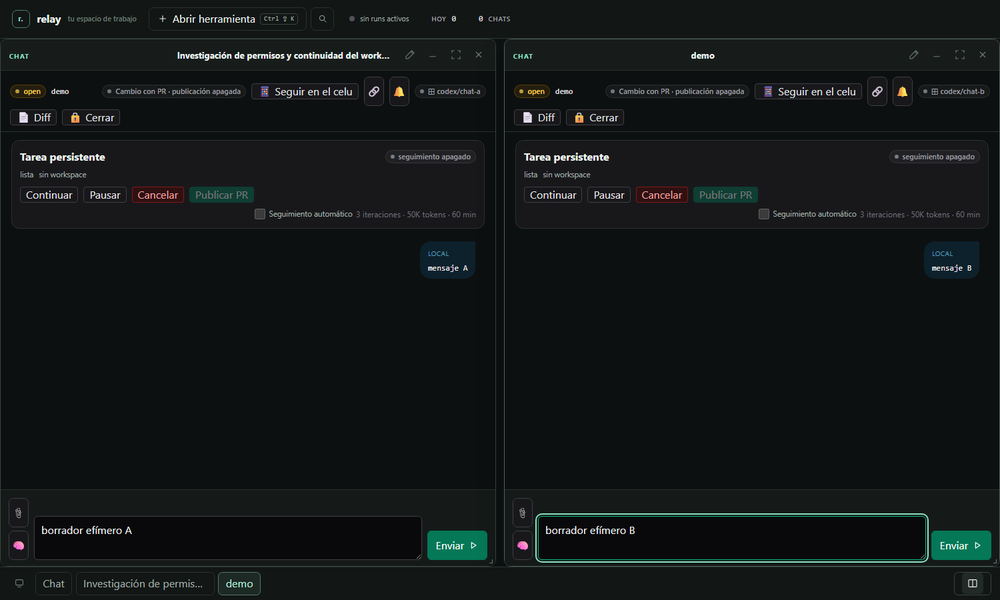
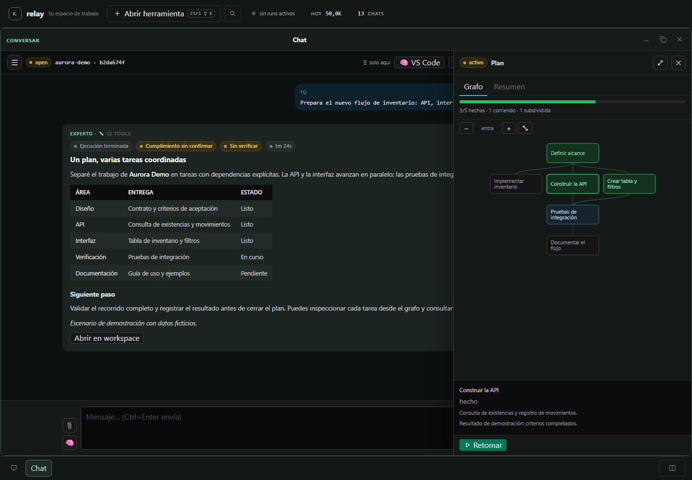
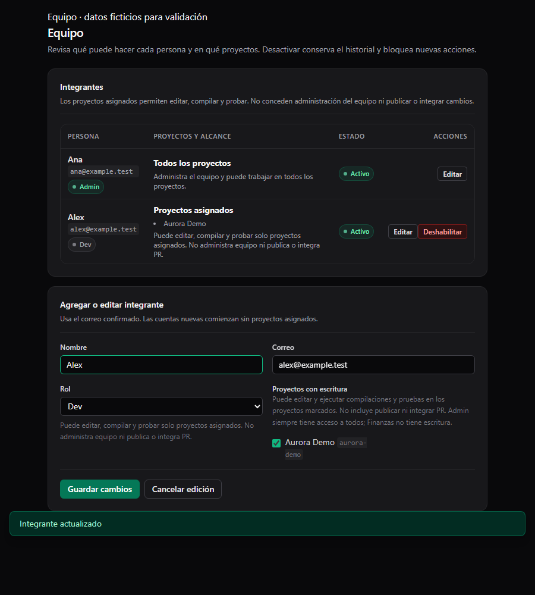

# FourBis Relay

**Español** · [English](README.en.md)

**Del seguimiento comercial a la ejecución y documentación del proyecto.**

FourBis Relay es un espacio de trabajo local para coordinar personas,
repositorios y agentes de IA alrededor del trabajo de una empresa. Puedes
poner un repositorio y un equipo a trabajar, mantener el contexto del cliente
y revisar los cambios dentro de tu flujo de GitHub.

Sirve para conectar lo que un cliente necesita con quién lo hace, qué se está
ejecutando y qué evidencia queda para revisar la entrega. Una petición puede
seguir como tarea, conversación, cambios de código y pull request, conservando
su contexto cuando llega una corrección o hay que continuar otro día.

**Explora la [demo estática](https://fourbis.github.io/4bis.relay-showcase/)**: una interfaz simulada con datos ficticios. No se conecta a Relay, no llama a un proveedor de IA ni ejecuta herramientas. Relay es software experimental para uso local.

Proyecto de portafolio de FourBis y Jeremías Badilla, publicado bajo la licencia MIT. Consulta [LICENSE](LICENSE) para la licencia del proyecto y [THIRD_PARTY_NOTICES.md](THIRD_PARTY_NOTICES.md) para los avisos de terceros.

## Un recorrido de trabajo

1. **Seguir al cliente y la oportunidad.** Consulta el CRM y vincula un cliente
   o una oportunidad con sus proyectos. Desde ese contexto puedes llegar al
   repositorio, su tablero de GitHub, issues y PRs para revisar el trabajo asociado.
2. **Organizar el equipo.** Registra los repositorios y asigna proyectos a cada
   integrante. Admin, Subadmin, Dev y Finanzas tienen alcances distintos. Las
   acciones de GitHub usan la cuenta de la persona que las realiza.
3. **Convertir el pedido en trabajo.** Abre una tarea, opcionalmente vinculada a
   un issue. Relay puede planificarla, ejecutarla con herramientas del proyecto
   y dividir trabajo grande en subtareas con dependencias. El equipo ve el avance,
   responde preguntas y conserva los archivos al pausar o retomar.
4. **Revisar dentro de GitHub.** Consulta el diff y las pruebas sobre la rama de
   la tarea. Cuando el administrador autoriza publicar, Relay valida el commit
   y prepara su PR. El seguimiento opcional permite recibir comentarios,
   solicitudes de cambios y fallos de CI, corregir y actualizar la misma PR.
5. **Conservar lo aprendido.** Conversación, resultados, pruebas y documentación
   solicitada acompañan el proyecto. Puedes pedir una explicación, corregir un
   detalle o continuar sobre la misma tarea sin perder la relación con su trabajo.

El equipo define el alcance y decide qué se entrega. La integración comercial
actual consulta el CRM configurado y permite vincular sus registros con proyectos;
convertir una oportunidad en trabajo requiere esa decisión explícita. Publicar
una PR deja el cambio pendiente de revisión: merge y despliegue tienen su propia
autorización. El seguimiento de PR se activa con límites de tiempo, uso e iteraciones.

## Un ejemplo

Un cliente pide migrar una aplicación. Vinculas la oportunidad con el proyecto,
asignas el repositorio al equipo y abres una tarea vinculada al issue. Relay organiza
la migración en tareas; si necesita repartir una tarea grande, puede subdividirla
durante la ejecución. Revisas los cambios y las comprobaciones, solicitas la
documentación de la migración y autorizas una PR. Los ajustes de la revisión
continúan sobre ese trabajo.

Este recorrido puede servir tanto para una migración extensa como para una
corrección puntual o el mantenimiento de varios proyectos de clientes.

## Un proceso que evoluciona

Relay nace del trabajo diario de FourBis. Ha ido creciendo junto con las
capacidades de los modelos y con lo que el equipo necesita para organizar,
ejecutar y documentar sus proyectos. Las decisiones sobre continuidad, permisos
y revisión responden a esa experiencia de uso.

Puedes elegir modelos para distintas etapas y configurar las herramientas de
cada proyecto. Esa separación permite incorporar capacidades nuevas manteniendo el
proyecto, el equipo y el flujo de GitHub como referencia. Cada integración nueva
necesita configuración y comprobación en el proceso donde se va a usar.

Consulta [equipo y permisos](docs/TEAM_ACCESS.md), [cuentas personales](docs/USER_ACCOUNTS.md),
[tareas persistentes y PR](docs/PERSISTENT_TASKS.md) y [trabajo largo](docs/LONG_RUNNING_WORK.md)
para el comportamiento y los límites de cada parte. La [guía del workspace](docs/UI_WORKSPACE.md)
muestra cómo trabajar con chats, grafos, archivos y resultados a la vista.

## Presentación


Vista del workspace local.



Conversaciones simultáneas con borradores independientes.



Dependencias y avance de una tarea.



Equipo y asignación de proyectos, con identidades ficticias.

*Las capturas muestran una demostración con datos ficticios. No representan actividad de proveedores externos ni una instalación pública.*

## Inicio rápido en Windows

Requisitos: Python 3.11 o posterior y PowerShell. Windows es el único destino de instalación validado; la portabilidad a otros sistemas no está establecida.

```powershell
cd C:\ruta\al\repositorio\mcp-server
python -m venv .venv
& ".\.venv\Scripts\Activate.ps1"
python -m pip install --upgrade pip
pip install -e .
.\start.ps1
```

En otra ventana de PowerShell:

```powershell
Invoke-RestMethod http://127.0.0.1:8413/health
Start-Process http://127.0.0.1:8413/admin/
```

`start.ps1` define defaults locales, incluido `GOOGLE_REAL=0`, antes de iniciar el servidor. No lee automáticamente un archivo `.env`. Si quieres ejecutar un experto, configura las credenciales del modelo en el catálogo **Modelos** de la Admin UI. El servidor puede iniciar sin proveedor de modelos, pero la ejecución del experto no podrá completarse. Los proveedores remotos opcionales reciben el contenido incluido en una ejecución.

## Documentación

- [Instalación completa](docs/SETUP.md)
- [API HTTP](docs/API.md)
- [Admin UI](docs/ADMIN_UI.md)
- [Comportamiento del workspace y acceso por teclado](docs/UI_WORKSPACE.md)
- [Tareas persistentes, validación y límites](docs/PERSISTENT_TASKS.md)
- [Trabajo largo y subdivisión durante la ejecución](docs/LONG_RUNNING_WORK.md)
- [Equipo y asignación de proyectos](docs/TEAM_ACCESS.md)
- [Mi cuenta: GitHub y Google/Gmail](docs/USER_ACCOUNTS.md)
- [Arquitectura](docs/ARCHITECTURE.md)
- [Evidencia de validación y límites conocidos](docs/VALIDATION.md)
- [Límites de seguridad](SECURITY.md)
- [Contribuir](CONTRIBUTING.md)

## Estado y comentarios

Relay es software experimental para uso local. La instalación y validación documentadas tienen como destino Windows. Los resultados registrados usan datos ficticios y proveedores simulados; no acreditan preparación para producción, aislamiento multiusuario, integración real con proveedores ni despliegue. Lee [VALIDATION.md](docs/VALIDATION.md) y [SECURITY.md](SECURITY.md) antes de usarlo con repositorios o credenciales reales.

¿Encontraste un problema o tienes una sugerencia concreta? [Abre un issue](https://github.com/FourBis/4bis.relay-showcase/issues).

## Atribución y licencia

FourBis · Jeremías Badilla. El proyecto se distribuye bajo la licencia MIT; los componentes de terceros conservan sus propias licencias y avisos.
