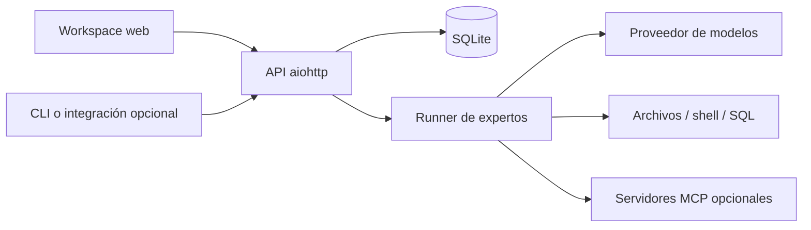

# Arquitectura

Relay es una aplicación local: un servidor Python sirve la API HTTP y el
workspace web. SQLite conserva proyectos, conversaciones, modelos, configuración
y ejecuciones. Las exportaciones de conversación y los adjuntos viven en disco.

## Flujo de una conversación

1. El usuario selecciona un proyecto y envía un mensaje.
2. La API registra la ejecución y devuelve su identificador.
3. El runner resuelve el modelo, el contexto del proyecto y las herramientas.
4. Cuando están habilitadas, las etapas separan planificación, ejecución,
   verificación y documentación.
5. La API expone progreso y resultado; el workspace puede mantener otras
   herramientas visibles mientras la conversación continúa.

El workspace usa módulos JavaScript nativos y CSS compilado. Sus ventanas
reutilizan los componentes y endpoints existentes. La disposición se guarda en
el navegador; las respuestas extraídas se recuperan desde su conversación.

## Componentes

| Ruta | Responsabilidad |
| --- | --- |
| `mcp-server/src/relay/server.py` | API y ciclo de vida del proceso |
| `mcp-server/src/relay/admin.py` | UI y endpoints administrativos |
| `mcp-server/src/relay/experts.py` | Modelos, contexto y ejecución |
| `mcp-server/src/relay/db.py` | SQLite e inicialización del esquema |
| `mcp-server/src/relay/config.py` | Configuración efectiva |
| `mcp-server/src/relay/mcp_pool.py` | Conexiones con herramientas MCP |
| `mcp-server/admin_static/` | Workspace y recursos locales |

Los cuatro entrypoints principales conservan sus imports históricos y delegan
en módulos por responsabilidad: `server_app` compone las rutas `server_*`,
`admin_*` agrupa los endpoints administrativos, `expert_*` separa preparación y
ejecución, y `db_*` agrupa consultas sobre la misma base SQLite. El estado mutable
de cada ejecución vive en `ExpertRunState`. Un check limita los módulos Python
a 650 líneas, con 500 como guía.

## Tareas persistentes

Una tarea usa la identidad de su conversación. `task_workspace` asigna una rama
y un worktree a cada tarea de escritura; los mensajes siguientes reutilizan esa
carpeta. `db_conversation_tasks` conserva la cola y sus recibos en SQLite.
`task_service` coordina un escritor por tarea y el seguimiento opcional de PR;
`task_pr` vincula la validación al commit que se publica.

La recuperación tras reiniciar conserva cambios y eventos pendientes. Un efecto
incierto se reconcilia antes de repetirse. El seguimiento comienza apagado y está
limitado por tiempo, iteraciones y tokens. El detalle de uso, permisos y límites
está en [Tareas persistentes](PERSISTENT_TASKS.md).

La UI abre cada conversación en una ventana del mismo origen. El ID sigue siendo
la referencia interna aunque cambie el nombre local de la ventana. No se guardan
mensajes sin enviar en el almacenamiento del navegador.

## Alcance

La instalación documentada es Windows con PowerShell. Discord, CRM, voz,
indexación de repositorios y proveedores remotos son integraciones opcionales;
no hacen falta para abrir la UI. Usar un proveedor remoto transmite a ese
proveedor el contenido que la ejecución incluya.

Las herramientas pueden leer y modificar repositorios y ejecutar comandos.
La publicación del código no convierte el servicio en un entorno multiusuario
aislado: véase [SECURITY.md](../SECURITY.md).
